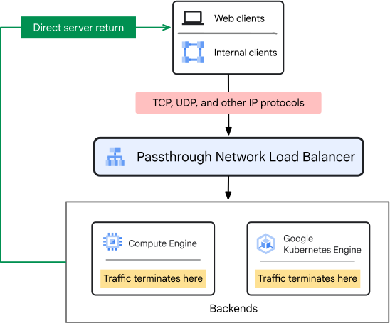
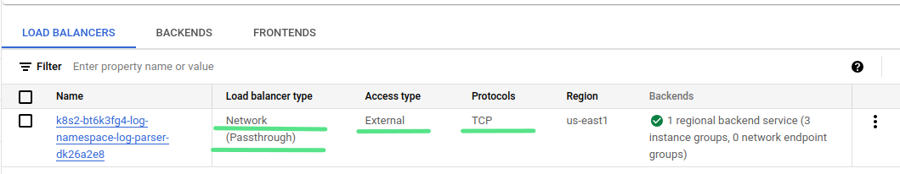
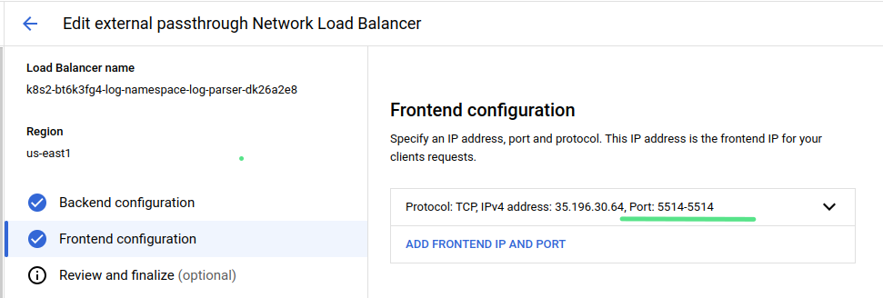
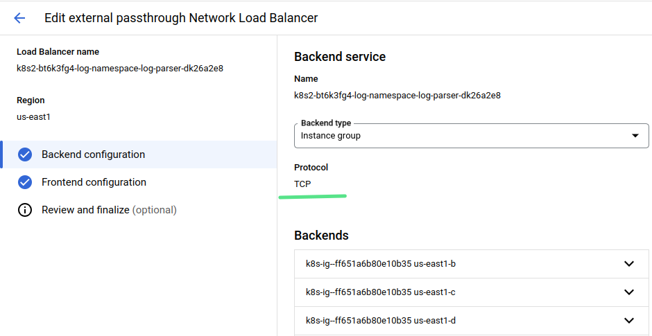

## GKE-LB-L4-Passthrough

I recently spent some time building an Load Balancer l4 pass-through. It took more time than I expected, so I decided to share the implementation. 
Searching for information on this topic yielded a couple of articles (which seem to be copied from each other) where the author suggests linking a cluster IP with an LB. 
Yeah, as if it was that simple, but it's already working. The official Google guide describes everything beautifully with pictures but doesn't provide a single example, 
only theory (https://cloud.google.com/load-balancing/docs/passthrough-network-load-balancer).


So, let's get started.
In this example, let's consider a service inside GKE named "log-parser" which accepts TCP traffic on port 5514 and, 
for correct message processing, it needs external IP devices from which this traffic is sent. For rollout test case 

1. Connect to GKE
```commandline
gcloud container clusters get-credentials <CLUSTER-NAME> --region <REGION> --project <PROJECT-NAME>
```
2. Use `kubectl apply -f demo-deploy.yaml && kubectl apply -f demo-service.yaml` for rollout application
3. To check LB rule follow to the link https://console.cloud.google.com/net-services/loadbalancing/list/loadBalancers



4. To check service External IP and port enter command
```
kubectl get svc -n log-namespace
NAME         TYPE           CLUSTER-IP      EXTERNAL-IP    PORT(S)          AGE
log-parser   LoadBalancer   10.27.218.204   35.196.30.64   5514:30060/TCP   11m
```
5. To check external port workability using telnet utility  
```
telnet 35.196.30.64 5514
Trying 35.196.30.64...
Connected to 35.196.30.64.
Escape character is '^]'.
^]
telnet> quit
Connection closed.
```
